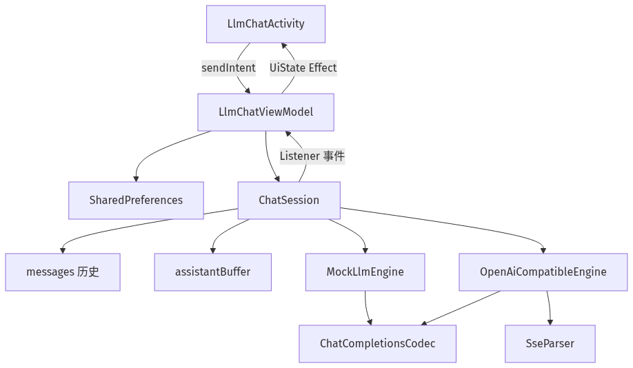
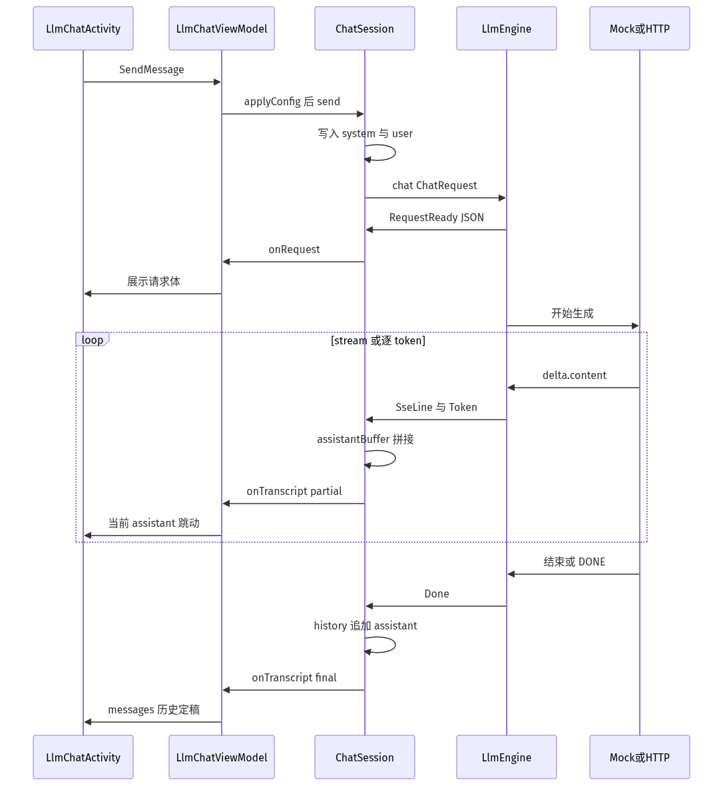
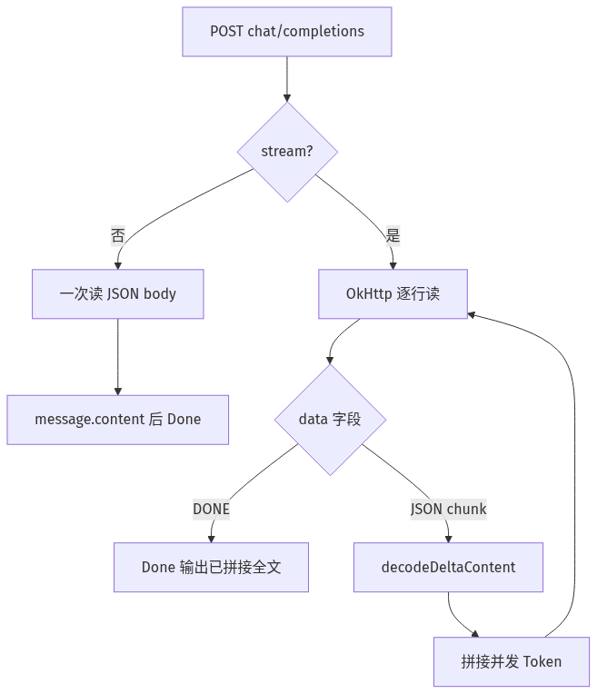

# LLM 学习 Demo 框架逻辑

记录时间：2026-09-21  
模块：独立 Android Library `:LlmSdk`（包名 `com.haha.llmsdk`）  
Demo 页：`com.haha.llm.ui.LlmChatActivity`（首页按钮「LLM 学习 Demo」）  
路由：`RoutePath.LLM_CHAT` → `/llm/chat`

配套流程图：

| 图         | PNG                                    | SVG                                    | 源文件                                    |
|-----------|----------------------------------------|----------------------------------------|----------------------------------------|
| 模块分层      | [png](assets/llm-sdk-architecture.png) | [svg](assets/llm-sdk-architecture.svg) | [mmd](assets/llm-sdk-architecture.mmd) |
| 一次发送时序    | [png](assets/llm-sdk-chat-flow.png)    | [svg](assets/llm-sdk-chat-flow.svg)    | [mmd](assets/llm-sdk-chat-flow.mmd)    |
| 流式 SSE 解析 | [png](assets/llm-sdk-sse-parse.png)    | [svg](assets/llm-sdk-sse-parse.svg)    | [mmd](assets/llm-sdk-sse-parse.mmd)    |

本文说明：页面如何把一句 user 变成 `messages`，引擎如何按 Chat Completions 协议吐 token，客户端如何把
SSE 增量拼成 assistant。和 `:BluetoothSdk` / `:speech-asr` 一样，可复用能力在 Library，页面只留 MVI。

---

## 1. 为什么拆成独立模块

app 不直接拼 HTTP、不解析 SSE。换 Mock / OpenAI / Ollama 只换引擎，会话层不变。

| 层  | 位置                                   | 职责                                                |
|----|--------------------------------------|---------------------------------------------------|
| UI | `app/.../llm/ui`                     | MVI 页：配置、发送、展示 JSON / SSE / 字幕式拼接                 |
| 会话 | `ChatSession`                        | 维护 `messages` 历史，把引擎事件聚合成 transcript / partial    |
| 引擎 | `LlmEngine`                          | Mock 或 OpenAI Compatible；统一 `chat()` + `LlmEvent` |
| 协议 | `ChatCompletionsCodec` / `SseParser` | 编解码请求体、解析 `data:` 行                               |



学习时按目录往下看：先看 `ChatModels` 和 `ChatSession`，再看两个 Engine。

---

## 2. 核心对象

Chat Completions 的对话状态就是一份列表，服务端默认不记会话，下次要把历史再带上。

| 类型            | 含义                                   |
|---------------|--------------------------------------|
| `ChatRole`    | `system` 人设、`user` 输入、`assistant` 回复 |
| `ChatMessage` | `{ role, content }`                  |
| `ChatRequest` | `{ model, messages, stream }`        |
| `LlmConfig`   | 引擎类型、baseUrl、apiKey、model、是否流式       |
| `LlmEvent`    | 一次生成过程中的学习事件                         |

`apiKey` 只放 HTTP Header（`Authorization: Bearer ***`），**不进请求 JSON**。页面上看到的请求体只有
`model` / `messages` / `stream`。

`LlmEvent` 对应 Demo 上几块区域：

| 事件             | Demo 展示                        |
|----------------|--------------------------------|
| `RequestReady` | 请求 URL、Header 提示、messages JSON |
| `SseLine`      | 最近一条 SSE `data`                |
| `Token`        | 当前 assistant 正在拼接的字            |
| `Usage`        | prompt / completion token 数    |
| `Done`         | 写入历史，流结束                       |
| `Error`        | Toast                          |

---

## 3. 一次发送怎么走

数据流仍是 MVI：`View sendIntent` → `ViewModel handleIntent` → `ChatSession` → `UiState` → `render`。

1. 首页 `DOFRouter` 打开 `LlmChatActivity`。
2. 点击发送：`SendMessage(text, config)`。
3. ViewModel 先把 config 写成 `LlmConfig`（并记 SharedPreferences），再 `session.send()`。
4. `ChatSession`：若还没有 system 则插入人设；追加本轮 user；用整份 history 构造 `ChatRequest`。
5. `LlmEngineFactory` 按 `LlmProvider` 给出 Mock 或 HTTP 引擎，`chat()` 返回可 `cancel()` 的
   `LlmCall`。
6. 引擎先发 `RequestReady`，再按 `stream` 吐 `Token` / `SseLine`，最后 `Done`。
7. Session 把 token 拼进 `assistantBuffer`（页面「当前 assistant」）；`Done` 后写入 history（页面「messages
   历史」）。



`generation` 用来丢掉过期回调：`stop()` / 再次 `send()` 会加一代，旧引擎再吐 token 也不再改 UI。

---

## 4. 两个引擎

`LlmEngineFactory.create(config)`：

| 引擎                       | 何时                  | 行为                                   |
|--------------------------|---------------------|--------------------------------------|
| `MockLlmEngine`          | 默认                  | 不发网，仍编码真实请求 JSON，并按 SSE 形态逐 token 吐出 |
| `OpenAiCompatibleEngine` | 选 OpenAI Compatible | `POST {baseUrl}/chat/completions`    |

Mock 用来先看懂协议。可问「什么是 SSE / token / messages」，会给出对应说明；其它句子会回显 user 内容，提示切到
HTTP 后这段会进 `messages`。

HTTP 兼容同一套 JSON：OpenAI、DeepSeek、硅基流动、本机 Ollama（`/v1`）。模拟器访问宿主机 Ollama 用
`http://10.0.2.2:11434/v1`。应用已允许 localhost / `10.0.2.2` 明文 HTTP。

URL 规则：`baseUrl` 若还没有 `/chat/completions` 就补上。

---

## 5. 流式 SSE

`stream=true` 时响应是 `text/event-stream`，不是一次 JSON。OpenAI Compatible 常见形态：

```text
data: {"choices":[{"delta":{"content":"你"}}]}

data: {"choices":[{"delta":{"content":"好"}}]}

data: [DONE]
```

`SseParser` 只认一行一个字段：`data:` / `event:` / `id:`，空行是事件分隔，`:` 开头是注释。

`OpenAiCompatibleEngine` 读流时：

1. `BufferedSource.readUtf8Line()`
2. `parseLine` 得到 `SseEvent.Data`
3. 原文发给 `SseLine`（Demo 里「最近一条 SSE data」）
4. `data: [DONE]` → `Done`
5. 否则 `decodeDeltaContent` 取 `choices[0].delta.content`，拼进缓冲区并发 `Token`
6. 若 chunk 带 `usage` 则发 `Usage`

`stream=false` 则一次读 body：`choices[0].message.content`。



和 speech-asr 的 Partial / Final 对照：这里 **Token 是增量追加**（不能覆盖），`Done` 才把整句写入
history。ASR 的 Partial 会被下一帧覆盖。

---

## 6. 页面状态

`LlmChatUiState` 单 data class，`render` 幂等：

- `transcript`：已定稿的 `[system] / [user] / [assistant]`
- `partialText`：当前正在拼的 assistant
- `requestJson` / `lastSse`：协议可视化
- `isStreaming`：发送禁用、停止可用

配置（Mock / HTTP、baseUrl、model、apiKey、stream）以页面输入为准，发送时带进 Intent；apiKey 只存在本机
`SharedPreferences`（`llm_learn_demo`），不进 git。

---

## 7. 怎么跑

1. 首页 → 「LLM 学习 Demo」
2. 默认 Mock，输入「什么是 SSE」或任意一句，看请求 JSON 和 token 拼接
3. 切 OpenAI Compatible：填 baseUrl、model、apiKey，保持 `stream=true` 看真 SSE
4. 「停止」取消当前 `LlmCall`；未完成的 buffer 会作为 assistant 写入历史
5. 「清空」清 history 和协议展示

不需要额外权限。HTTP 模式才需要网络。
